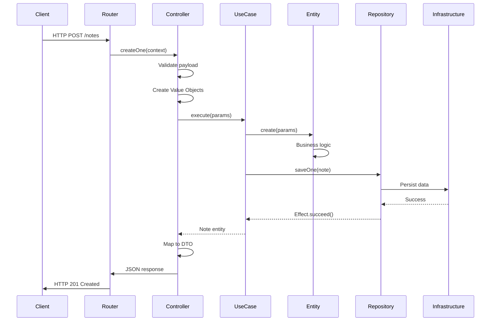
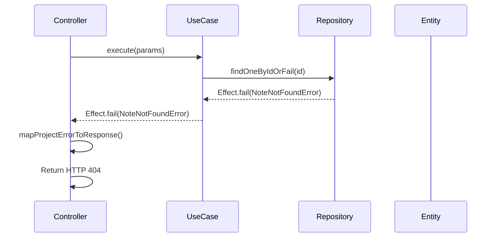
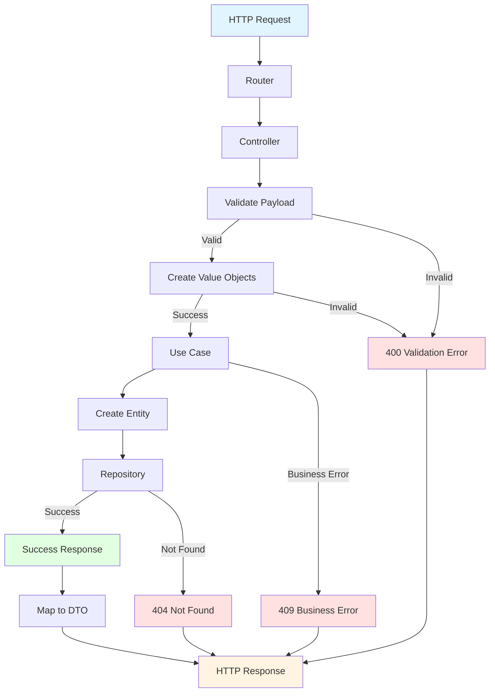

# 🔄 Data Flow

[← Back to Main README](../README.md)

## Table of Contents

- [Overview](#overview)
- [Request Lifecycle](#request-lifecycle)
- [Detailed Flow](#detailed-flow)
- [Example: Creating a Note](#example-creating-a-note)
- [Error Handling Flow](#error-handling-flow)
- [Response Flow](#response-flow)

## Overview

Understanding how data flows through the application is crucial for debugging, optimization, and extending functionality. This document explains the complete lifecycle of an HTTP request from entry to response.

## Request Lifecycle

A typical HTTP request follows this path through the application:



## Detailed Flow

### 1. **HTTP Request Arrives**

The HTTP server (Fastify) receives the request and routes it based on the URL pattern.

**Entry Point:**

```typescript
// config/http/fastify.ts
this.fastify.post('/notes', async (request, reply) => {
  await handler({ request, reply });
});
```

### 2. **Router Registration**

Routes are registered in the domain's router:

```14:28:packages/backend/src/domains/notes-management/adapters/inbound/routers/PublicRouter.ts
  public registerRoutes(): void {
    this.httpServer.post('/notes', (context) =>
      this.controllers.notesController.createOne(context)
    );
    this.httpServer.get('/notes', (context) => this.controllers.notesController.getAll(context));
    this.httpServer.get('/notes/:id', (context) =>
      this.controllers.notesController.getOne(context)
    );
    this.httpServer.delete('/notes/:id', (context) =>
      this.controllers.notesController.deleteOne(context)
    );
    this.httpServer.put('/notes/:id', (context) =>
      this.controllers.notesController.updateOne(context)
    );
  }
```

### 3. **Controller Processing**

The controller receives the request context and processes it:

```21:43:packages/backend/src/domains/notes-management/adapters/inbound/controllers/NotesController.ts
  async createOne(context: Context): Promise<void> {
    await Effect.Do.pipe(
      Effect.bind('validPayload', () =>
        this.validateSchema({ payload: context.request.body, schema: V1.api.CreateNoteDTOSchema })
      ),
      Effect.bind('title', ({ validPayload }) => NoteTitle.create(validPayload.title)),
      Effect.bind('content', ({ validPayload }) => NoteContent.create(validPayload.content)),
      Effect.flatMap(({ title, content }) =>
        this.useCases.createNote.execute({
          content,
          title,
        })
      ),
      Effect.map((note) => ({
        body: {
          message: 'Note created successfully',
          data: NoteMapper.toDTO(note),
        },
        httpCode: 201,
      })),
      this.runEffectToJson(context)
    );
  }
```

**Controller Responsibilities:**

1. ✅ **Validate input** - Validate request payload against schema
2. ✅ **Create value objects** - Transform validated data into domain value objects
3. ✅ **Call use case** - Execute business logic via use case
4. ✅ **Map to DTO** - Transform domain entity to DTO for response
5. ✅ **Send response** - Return HTTP response with appropriate status code

### 4. **Use Case Execution**

The use case orchestrates the business operation:

```22:32:packages/backend/src/domains/notes-management/domain/use-cases/CreateNote.ts
  execute(params: CreateNoteParams): Effect.Effect<Note, ExpectedErrors> {
    const note = Note.create({
      content: params.content,
      title: params.title,
    });

    return pipe(
      this.deps.notesRepository.saveOne(note),
      Effect.map(() => note)
    );
  }
```

**Use Case Responsibilities:**

1. ✅ **Create entity** - Use entity factory method
2. ✅ **Persist entity** - Save via repository
3. ✅ **Return result** - Return created entity wrapped in Effect

### 5. **Entity Creation**

The entity encapsulates business logic:

```27:35:packages/backend/src/domains/notes-management/domain/entities/Note.ts
  static create(params: NoteCreateParams): Note {
    return new Note({
      content: params.content.value,
      createdAt: new Date(),
      deletedAt: null,
      id: createNoteId(),
      title: params.title.value,
    });
  }
```

**Entity Responsibilities:**

1. ✅ **Initialize state** - Set initial values
2. ✅ **Generate ID** - Create unique identifier
3. ✅ **Set timestamps** - Record creation time
4. ✅ **Enforce invariants** - Ensure valid state

### 6. **Repository Persistence**

The repository interface is called, which delegates to infrastructure:

```27:32:packages/backend/src/infrastructure/in-memory/InMemoryNotesRepository.ts
  saveOne(note: Note): Effect.Effect<void> {
    const state = note.toState();

    this.notes.set(state.id, state);
    return Effect.succeed(undefined);
  }
```

**Repository Responsibilities:**

1. ✅ **Serialize entity** - Convert entity to state
2. ✅ **Persist data** - Save to storage (database, memory, etc.)
3. ✅ **Return result** - Return success/failure via Effect

## Example: Creating a Note

Let's trace a complete example of creating a note:

### Step-by-Step Flow

#### 1. Client Sends Request

```http
POST /notes HTTP/1.1
Content-Type: application/json

{
  "title": "My First Note",
  "content": "This is the content of my note"
}
```

#### 2. Router Routes to Controller

```typescript
// Router receives request
httpServer.post('/notes', (context) => notesController.createOne(context));
```

#### 3. Controller Validates and Processes

```typescript
// Controller validates payload
const validPayload = await validateSchema({
  payload: { title: 'My First Note', content: '...' },
  schema: CreateNoteDTOSchema,
});

// Create value objects
const title = await NoteTitle.create(validPayload.title);
const content = await NoteContent.create(validPayload.content);
```

#### 4. Use Case Executes

```typescript
// Use case creates entity
const note = Note.create({
  title: NoteTitle { value: "My First Note" },
  content: NoteContent { value: "This is the content..." }
});

// Entity state:
{
  id: "note_123",
  title: "My First Note",
  content: "This is the content...",
  createdAt: 2024-01-15T10:30:00Z,
  deletedAt: null
}

// Persist via repository
await notesRepository.saveOne(note);
```

#### 5. Response Sent

```http
HTTP/1.1 201 Created
Content-Type: application/json

{
  "message": "Note created successfully",
  "data": {
    "id": "note_123",
    "title": "My First Note",
    "content": "This is the content...",
    "createdAt": "2024-01-15T10:30:00Z"
  }
}
```

## Error Handling Flow

Errors can occur at multiple points in the flow. Here's how they're handled:



### Error Types and Handling

| Error Type          | Source                | HTTP Status | Example                  |
| ------------------- | --------------------- | ----------- | ------------------------ |
| `ValidationError`   | Value Object creation | 400         | Invalid title length     |
| `NoteNotFoundError` | Repository lookup     | 404         | Note ID doesn't exist    |
| `DuplicateError`    | Business rule         | 409         | Note already exists      |
| `ForbiddenError`    | Authorization         | 403         | Insufficient permissions |
| Internal Error      | Unexpected            | 500         | System error             |

### Error Mapping

The controller maps domain errors to HTTP responses:

```22:57:packages/backend/src/shared/Controller.ts
  protected mapProjectErrorToResponse(error: Error): Response {
    const body: Response['body'] = { message: error.message };

    if (error instanceof ValidationError) {
      return {
        body,
        httpCode: 400,
      };
    }

    if (error instanceof NotFoundError) {
      return {
        body,
        httpCode: 404,
      };
    }

    if (error instanceof DuplicateError) {
      return {
        body,
        httpCode: 409,
      };
    }

    if (error instanceof ForbiddenError) {
      return {
        body,
        httpCode: 403,
      };
    }

    return {
      body: { message: 'Internal Server Error' },
      httpCode: 500,
    };
  }
```

## Response Flow

After the use case completes, the response flows back:

### 1. Use Case Returns Entity

```typescript
// Use case returns Effect with entity
Effect.succeed(note);
```

### 2. Controller Maps to DTO

```typescript
// Controller maps entity to DTO
const dto = NoteMapper.toDTO(note);
// {
//   id: "note_123",
//   title: "My First Note",
//   content: "This is the content...",
//   createdAt: "2024-01-15T10:30:00Z"
// }
```

### 3. Controller Creates Response

```typescript
const response = {
  body: {
    message: 'Note created successfully',
    data: dto,
  },
  httpCode: 201,
};
```

### 4. Response Sent to Client

```typescript
// Controller sends JSON response
await context.reply.status(201).type('application/json').send(response.body);
```

## Complete Flow Diagram



## Key Takeaways

### ✅ Separation of Concerns

Each layer has a clear responsibility:

- **Router** - Routes requests
- **Controller** - Validates input, maps output
- **Use Case** - Orchestrates business logic
- **Entity** - Encapsulates business rules
- **Repository** - Handles persistence

### ✅ Type Safety

TypeScript and Effect ensure type safety throughout:

- Value objects validate at creation
- Use cases have typed parameters and returns
- Errors are typed and handled explicitly

### ✅ Functional Error Handling

Effect provides composable error handling:

- Errors are part of the type system
- No exceptions thrown
- Errors propagate through Effect chain

### ✅ Testability

Each layer can be tested independently:

- Controllers can be tested with mock use cases
- Use cases can be tested with in-memory repositories
- Entities can be tested in isolation

---

> 💡 **Next Steps**: Explore the [Patterns & Concepts](./patterns-and-concepts.md) to understand the design patterns used, or see a [complete domain example](./domain-example.md) with all components working together.
