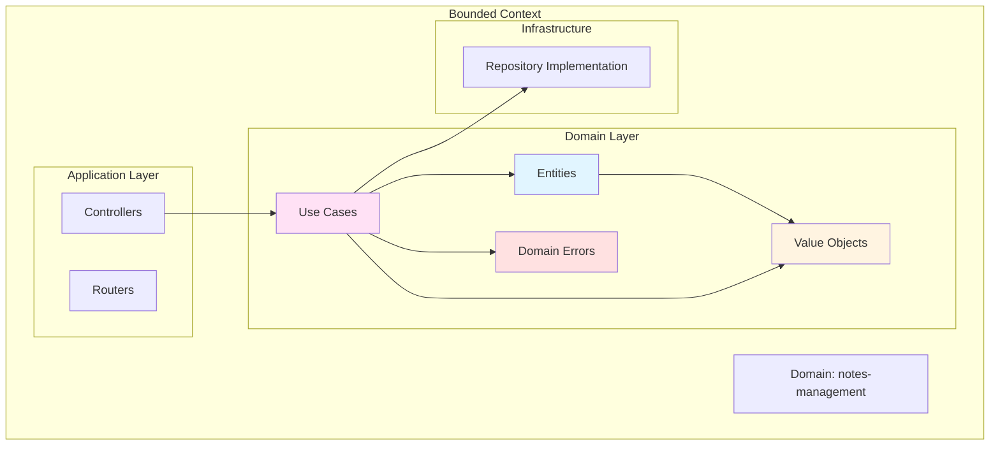
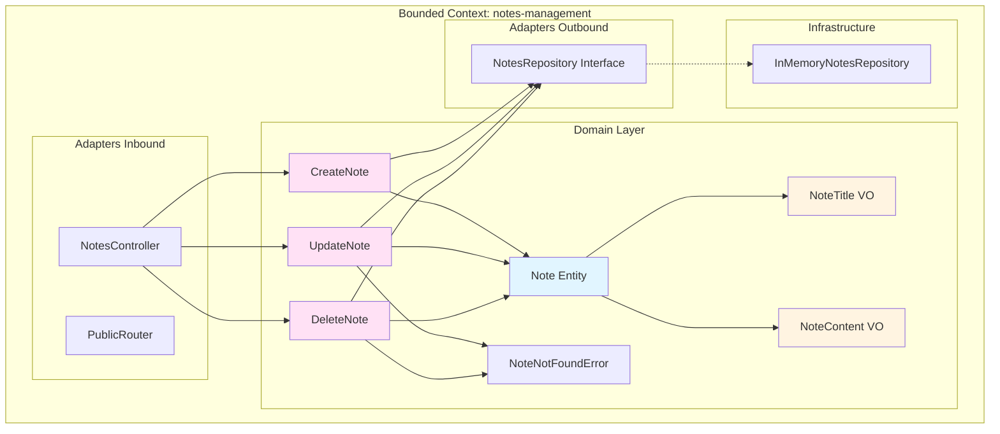

# 📦 Domain-Driven Design

[← Back to Main README](../README.md)

## Table of Contents

- [Overview](#overview)
- [Core Concepts](#core-concepts)
- [Bounded Contexts](#bounded-contexts)
- [Entities](#entities)
- [Value Objects](#value-objects)
- [Use Cases](#use-cases)
- [Domain Errors](#domain-errors)
- [Repository Pattern](#repository-pattern)
- [Domain Structure](#domain-structure)
- [Best Practices](#best-practices)

## Overview

**Domain-Driven Design (DDD)** is an approach to software development that focuses on modeling software to match a domain according to input from that domain's experts. In this project, DDD principles are applied to organize business logic into **bounded contexts** (domains), each representing a distinct area of business functionality.

### Key Philosophy

> The domain model should reflect the **real-world business concepts** and rules, not technical implementation details.

## Core Concepts

DDD introduces several key building blocks that help model complex business domains:



## Bounded Contexts

A **Bounded Context** is a logical boundary within which a particular domain model is valid. Each bounded context has its own:

- Domain model (entities, value objects)
- Ubiquitous language (terms specific to that domain)
- Business rules
- Use cases

### In Our Codebase

Each domain in `src/domains/` represents a bounded context:

```
domains/
├── notes-management/    # Bounded context for note management
│   ├── domain/          # Core domain logic
│   ├── adapters/        # Application adapters
│   └── config/          # Domain configuration
└── [future-domains]/    # Other bounded contexts
```

### Benefits

- ✅ **Isolation** - Changes in one domain don't affect others
- ✅ **Clarity** - Each domain has a clear, focused purpose
- ✅ **Scalability** - Easy to add new domains
- ✅ **Team Organization** - Teams can work on different domains independently

## Entities

**Entities** are objects that have a **unique identity** and a **lifecycle**. They are mutable and can change over time while maintaining their identity.

### Characteristics

- ✅ Have a **unique identifier** (ID)
- ✅ Are **mutable** (can change state)
- ✅ Have **business logic** and behavior
- ✅ Represent **real-world concepts** with identity

### Example: Note Entity

```22:63:packages/backend/src/domains/notes-management/domain/entities/Note.ts
export class Note extends BaseEntity<NoteState> {
  private constructor(state: NoteState) {
    super(NoteStateSchema.parse(state));
  }

  static create(params: NoteCreateParams): Note {
    return new Note({
      content: params.content.value,
      createdAt: new Date(),
      deletedAt: null,
      id: createNoteId(),
      title: params.title.value,
    });
  }

  static fromState(state: NoteState): Note {
    return new Note(NoteStateSchema.parse(state));
  }

  get content(): NoteContent {
    return Effect.runSync(NoteContent.create(this.state.content));
  }

  get title(): NoteTitle {
    return Effect.runSync(NoteTitle.create(this.state.title));
  }

  delete(): this {
    this.state.deletedAt = new Date();
    return this;
  }

  setContent(content: NoteContent): this {
    this.state.content = content.value;
    return this;
  }

  setTitle(title: NoteTitle): this {
    this.state.title = title.value;
    return this;
  }
}
```

### Key Points

1. **Identity**: Each `Note` has a unique `id`
2. **Lifecycle**: Created via `create()`, can be modified, can be deleted
3. **Business Logic**: Methods like `delete()`, `setContent()`, `setTitle()` encapsulate business rules
4. **Immutability of Value Objects**: Uses `NoteTitle` and `NoteContent` value objects

### Base Entity Class

All entities extend `BaseEntity`:

```6:20:packages/backend/src/shared/Entity.ts
export abstract class BaseEntity<T extends BaseEntityState> {
  protected constructor(protected readonly state: T) {}

  get createdAt(): Date {
    return this.state.createdAt;
  }

  get id(): T['id'] {
    return this.state.id;
  }

  toState(): T {
    return structuredClone(this.state);
  }
}
```

This provides:

- Common properties (`id`, `createdAt`)
- State management
- Serialization via `toState()`

## Value Objects

**Value Objects** are objects that are **defined by their attributes** rather than their identity. They are **immutable** and have no lifecycle.

### Characteristics

- ✅ **No identity** - Equality is based on value, not ID
- ✅ **Immutable** - Cannot be changed after creation
- ✅ **Self-validating** - Encapsulate validation logic
- ✅ **Replaceable** - Can be replaced entirely, not modified

### Example: NoteTitle Value Object

```9:16:packages/backend/src/domains/notes-management/domain/value-objects/NoteTitle.ts
export class NoteTitle extends ValueObject<NoteTitleProps> {
  static create(value: unknown): Effect.Effect<NoteTitle, ValidationError> {
    return pipe(
      this.validateSchema({ errorMessage: 'Invalid note title', schema: NoteTitleSchema, value }),
      Effect.map((validValue) => new NoteTitle(validValue))
    );
  }
}
```

### Validation

Value objects validate themselves during creation:

```6:7:packages/backend/src/domains/notes-management/domain/value-objects/NoteTitle.ts
export const NoteTitleSchema: z.ZodString = z.string().min(1).max(200);
type NoteTitleProps = z.infer<typeof NoteTitleSchema>;
```

- **Min length**: 1 character
- **Max length**: 200 characters
- **Type**: String

### Base Value Object Class

All value objects extend `ValueObject`:

```12:42:packages/backend/src/shared/ValueObject.ts
export abstract class ValueObject<T> {
  public readonly value: T;

  constructor(props: T) {
    this.value = Object.freeze(props);
  }

  public equals(valueObject: ValueObject<T>): boolean {
    if (valueObject === null || valueObject === undefined) {
      return false;
    }

    return isEqual(this.value, valueObject.value);
  }

  public static validateSchema<T>(
    params: ValidateSchemaParams<T>
  ): Effect.Effect<T, ValidationError> {
    const { value, schema, errorMessage } = params;

    const parseResult = schema.safeParse(value);

    if (parseResult.success) {
      return Effect.succeed(parseResult.data);
    }

    return Effect.fail(
      new ValidationError({ message: errorMessage, issues: parseResult.error.issues })
    );
  }
}
```

### Value Object Examples

| Value Object  | Validation Rules | Purpose                     |
| ------------- | ---------------- | --------------------------- |
| `NoteTitle`   | 1-200 characters | Represents a note's title   |
| `NoteContent` | 1-500 characters | Represents a note's content |

### When to Use Value Objects

Use value objects for:

- ✅ **Primitive obsession** - Replace strings/numbers with meaningful types
- ✅ **Validation** - Encapsulate validation rules
- ✅ **Type safety** - Prevent invalid states
- ✅ **Business concepts** - Represent domain concepts (Email, Money, Address)

## Use Cases

**Use Cases** (also called **Application Services**) orchestrate business operations. They coordinate between entities, value objects, and repositories to fulfill business requirements.

### Characteristics

- ✅ **Orchestrate** business operations
- ✅ **Stateless** - Don't hold state
- ✅ **Single responsibility** - One use case = one business operation
- ✅ **Use Effect** - For functional error handling

### Example: CreateNote Use Case

```17:33:packages/backend/src/domains/notes-management/domain/use-cases/CreateNote.ts
export class CreateNote extends PublicUseCase<CreateNoteParams, Note, ExpectedErrors> {
  constructor(private readonly deps: CreateNoteDependencies) {
    super();
  }

  execute(params: CreateNoteParams): Effect.Effect<Note, ExpectedErrors> {
    const note = Note.create({
      content: params.content,
      title: params.title,
    });

    return pipe(
      this.deps.notesRepository.saveOne(note),
      Effect.map(() => note)
    );
  }
}
```

### Use Case Flow

1. **Receive parameters** - Validated value objects (`NoteTitle`, `NoteContent`)
2. **Create entity** - Use entity factory method
3. **Persist** - Save via repository
4. **Return result** - Return created entity

### Base Use Case Class

All use cases extend `PublicUseCase`:

```7:13:packages/backend/src/shared/UseCase.ts
export default abstract class PublicUseCase<
  Params,
  Response,
  Errors extends Error,
> implements IPublicUseCase<Params, Response, Errors> {
  public abstract execute(request: Params): Effect.Effect<Response, Errors>;
}
```

### Use Cases in notes-management

| Use Case      | Purpose                 | Errors              |
| ------------- | ----------------------- | ------------------- |
| `CreateNote`  | Create a new note       | None                |
| `UpdateNote`  | Update an existing note | `NoteNotFoundError` |
| `DeleteNote`  | Soft delete a note      | `NoteNotFoundError` |
| `GetNoteById` | Retrieve a note by ID   | `NoteNotFoundError` |
| `GetAllNotes` | Retrieve all notes      | None                |

## Domain Errors

**Domain Errors** represent business-level error conditions. They are specific to the domain and carry meaningful business context.

### Characteristics

- ✅ **Domain-specific** - Represent business rule violations
- ✅ **Rich context** - Include relevant business information
- ✅ **Type-safe** - Extend base error types
- ✅ **Mappable** - Can be mapped to HTTP responses

### Example: NoteNotFoundError

```4:8:packages/backend/src/domains/notes-management/domain/errors/NoteNotFoundError.ts
export class NoteNotFoundError extends NotFoundError {
  constructor(id: NoteId) {
    super({ message: `Note with id ${id} not found.` });
  }
}
```

### Error Hierarchy

```
ProjectErrors
├── ValidationError
├── NotFoundError
│   └── NoteNotFoundError
├── DuplicateError
└── ForbiddenError
```

### Usage in Use Cases

```20:28:packages/backend/src/domains/notes-management/domain/use-cases/DeleteNote.ts
  execute(params: DeleteNoteParams): Effect.Effect<void, ExpectedErrors> {
    return pipe(
      this.deps.notesRepository.findOneByIdOrFail(params.id),
      Effect.flatMap((note) => {
        note.delete();
        return this.deps.notesRepository.saveOne(note);
      })
    );
  }
```

The repository method `findOneByIdOrFail` returns `Effect.Effect<Note, NoteNotFoundError>`, which is properly typed.

## Repository Pattern

The **Repository Pattern** provides an abstraction layer over data persistence. It defines **interfaces** in the domain layer and **implementations** in the infrastructure layer.

### Repository Interface (Port)

```6:10:packages/backend/src/domains/notes-management/adapters/outbound/NotesRepository.ts
export interface NotesRepository {
  findAll(): Effect.Effect<Note[]>;
  findOneByIdOrFail(id: NoteId): Effect.Effect<Note, NoteNotFoundError>;
  saveOne(note: Note): Effect.Effect<void>;
}
```

### Repository Implementation (Adapter)

```7:33:packages/backend/src/infrastructure/in-memory/InMemoryNotesRepository.ts
export class InMemoryNotesRepository implements NotesRepository {
  private readonly notes: Map<NoteId, NoteState> = new Map();

  findAll(): Effect.Effect<Note[]> {
    return Effect.succeed(
      Array.from(this.notes.values())
        .filter((noteState) => noteState.deletedAt === null)
        .map((noteState) => Note.fromState(noteState))
    );
  }

  findOneByIdOrFail(id: NoteId): Effect.Effect<Note, NoteNotFoundError> {
    const noteState = this.notes.get(id);
    if (!noteState) {
      return Effect.fail(new NoteNotFoundError(id));
    }

    return Effect.succeed(Note.fromState(noteState));
  }

  saveOne(note: Note): Effect.Effect<void> {
    const state = note.toState();

    this.notes.set(state.id, state);
    return Effect.succeed(undefined);
  }
}
```

### Benefits

- ✅ **Testability** - Easy to create in-memory implementations
- ✅ **Flexibility** - Can swap implementations (PostgreSQL, MongoDB, etc.)
- ✅ **Domain Independence** - Domain doesn't know about database details

## Domain Structure

A complete domain (bounded context) follows this structure:

```
notes-management/
├── adapters/
│   ├── inbound/              # Entry points
│   │   ├── controllers/      # HTTP controllers
│   │   └── routers/         # Route definitions
│   └── outbound/             # Exit points
│       └── NotesRepository.ts  # Repository interface
│
├── config/
│   └── notes-management-container.ts  # DI configuration
│
├── domain/                   # Core domain logic
│   ├── entities/            # Domain entities
│   ├── errors/              # Domain errors
│   ├── use-cases/          # Business operations
│   └── value-objects/      # Value objects
│
└── mappers/                 # DTO transformations
    └── NoteMapper.ts
```

### Visual Representation



## Best Practices

### 1. Keep Domain Pure

The domain layer should have **no dependencies** on:

- ❌ Web frameworks
- ❌ Databases
- ❌ External libraries (except utilities like Effect, Zod)

### 2. Use Value Objects for Validation

Instead of primitive types, use value objects:

```typescript
// ❌ Bad
function createNote(title: string, content: string) { ... }

// ✅ Good
function createNote(title: NoteTitle, content: NoteContent) { ... }
```

### 3. Encapsulate Business Logic in Entities

Business rules should live in entities:

```typescript
// ✅ Good - Business logic in entity
note.delete(); // Sets deletedAt timestamp

// ❌ Bad - Business logic in use case
note.state.deletedAt = new Date();
```

### 4. Use Effect for Error Handling

Leverage Effect's type-safe error handling:

```typescript
// ✅ Good - Typed errors
Effect.Effect<Note, NoteNotFoundError>;

// ❌ Bad - Throwing exceptions
throw new NoteNotFoundError(id);
```

### 5. One Use Case = One Operation

Keep use cases focused:

```typescript
// ✅ Good
class CreateNote { ... }
class UpdateNote { ... }
class DeleteNote { ... }

// ❌ Bad
class NoteOperations {
  create() { ... }
  update() { ... }
  delete() { ... }
}
```

---

> 💡 **Next Steps**: See a [complete example](./domain-example.md) of how all these DDD concepts work together in the `notes-management` domain, or learn about [data flow](./data-flow.md) through the application.

