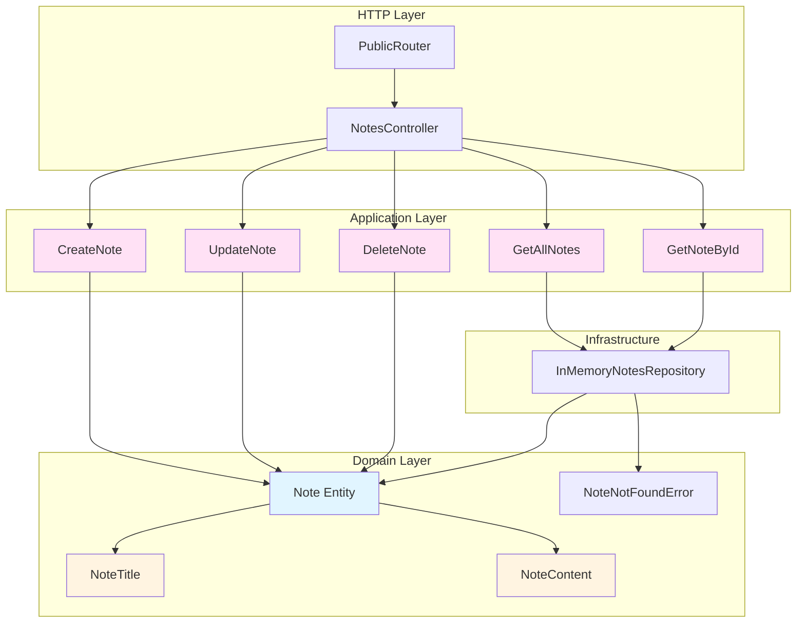

# 💡 Domain Example: notes-management

[← Back to Main README](../README.md)

## Table of Contents

- [Overview](#overview)
- [Domain Structure](#domain-structure)
- [Value Objects](#value-objects)
- [Entity](#entity)
- [Use Cases](#use-cases)
- [Domain Errors](#domain-errors)
- [Repository](#repository)
- [Controllers](#controllers)
- [Routers](#routers)
- [Configuration](#configuration)
- [Complete Flow Example](#complete-flow-example)

## Overview

The `notes-management` domain serves as a **complete example** of how all DDD and Hexagonal Architecture concepts work together. This domain implements a simple note-taking system with full CRUD operations.

### Domain Capabilities

- ✅ Create notes with title and content
- ✅ Retrieve all notes
- ✅ Retrieve a note by ID
- ✅ Update note title and content
- ✅ Soft delete notes (sets `deletedAt` timestamp)

## Domain Structure

```
notes-management/
├── adapters/
│   ├── inbound/
│   │   ├── controllers/
│   │   │   └── NotesController.ts
│   │   └── routers/
│   │       └── PublicRouter.ts
│   └── outbound/
│       └── NotesRepository.ts
├── config/
│   └── notes-management-container.ts
├── domain/
│   ├── entities/
│   │   └── Note.ts
│   ├── errors/
│   │   └── NoteNotFoundError.ts
│   ├── use-cases/
│   │   ├── CreateNote.ts
│   │   ├── DeleteNote.ts
│   │   ├── GetAllNotes.ts
│   │   ├── GetNoteById.ts
│   │   └── UpdateNote.ts
│   └── value-objects/
│       ├── NoteContent.ts
│       └── NoteTitle.ts
└── mappers/
    └── NoteMapper.ts
```

## Value Objects

Value objects encapsulate validation and represent domain concepts.

### NoteTitle

Represents a note's title with validation rules.

```9:16:packages/backend/src/domains/notes-management/domain/value-objects/NoteTitle.ts
export class NoteTitle extends ValueObject<NoteTitleProps> {
  static create(value: unknown): Effect.Effect<NoteTitle, ValidationError> {
    return pipe(
      this.validateSchema({ errorMessage: 'Invalid note title', schema: NoteTitleSchema, value }),
      Effect.map((validValue) => new NoteTitle(validValue))
    );
  }
}
```

**Validation Rules:**
- Minimum length: 1 character
- Maximum length: 200 characters
- Type: String

**Usage:**
```typescript
const title = await NoteTitle.create("My Note Title");
// Returns: Effect.Effect<NoteTitle, ValidationError>
```

### NoteContent

Represents a note's content with validation rules.

```9:20:packages/backend/src/domains/notes-management/domain/value-objects/NoteContent.ts
export class NoteContent extends ValueObject<NoteContentProps> {
  static create(value: unknown): Effect.Effect<NoteContent, ValidationError> {
    return pipe(
      this.validateSchema({
        errorMessage: 'Invalid note content',
        schema: NoteContentSchema,
        value,
      }),
      Effect.map((validValue) => new NoteContent(validValue))
    );
  }
}
```

**Validation Rules:**
- Minimum length: 1 character
- Maximum length: 500 characters
- Type: String

## Entity

The `Note` entity represents a note with identity and lifecycle.

### Entity Definition

```22:63:packages/backend/src/domains/notes-management/domain/entities/Note.ts
export class Note extends BaseEntity<NoteState> {
  private constructor(state: NoteState) {
    super(NoteStateSchema.parse(state));
  }

  static create(params: NoteCreateParams): Note {
    return new Note({
      content: params.content.value,
      createdAt: new Date(),
      deletedAt: null,
      id: createNoteId(),
      title: params.title.value,
    });
  }

  static fromState(state: NoteState): Note {
    return new Note(NoteStateSchema.parse(state));
  }

  get content(): NoteContent {
    return Effect.runSync(NoteContent.create(this.state.content));
  }

  get title(): NoteTitle {
    return Effect.runSync(NoteTitle.create(this.state.title));
  }

  delete(): this {
    this.state.deletedAt = new Date();
    return this;
  }

  setContent(content: NoteContent): this {
    this.state.content = content.value;
    return this;
  }

  setTitle(title: NoteTitle): this {
    this.state.title = title.value;
    return this;
  }
}
```

### Entity State

```8:16:packages/backend/src/domains/notes-management/domain/entities/Note.ts
const NoteStateSchema = z.object({
  content: NoteContentSchema,
  createdAt: z.date(),
  deletedAt: z.date().nullable(),
  id: NoteIdSchema,
  title: NoteTitleSchema,
});

export type NoteState = z.infer<typeof NoteStateSchema>;
```

### Entity Methods

| Method | Purpose | Returns |
|--------|---------|---------|
| `create()` | Factory method to create a new note | `Note` |
| `fromState()` | Reconstruct entity from state | `Note` |
| `delete()` | Soft delete (sets `deletedAt`) | `this` |
| `setContent()` | Update note content | `this` |
| `setTitle()` | Update note title | `this` |
| `toState()` | Serialize to state (inherited) | `NoteState` |

### Business Rules

1. **Soft Delete** - Notes are not physically deleted, but marked with `deletedAt`
2. **Immutability of Value Objects** - Title and content are value objects, ensuring validation
3. **Automatic Timestamps** - `createdAt` is set automatically on creation

## Use Cases

Each use case represents a single business operation.

### CreateNote

Creates a new note.

```17:33:packages/backend/src/domains/notes-management/domain/use-cases/CreateNote.ts
export class CreateNote extends PublicUseCase<CreateNoteParams, Note, ExpectedErrors> {
  constructor(private readonly deps: CreateNoteDependencies) {
    super();
  }

  execute(params: CreateNoteParams): Effect.Effect<Note, ExpectedErrors> {
    const note = Note.create({
      content: params.content,
      title: params.title,
    });

    return pipe(
      this.deps.notesRepository.saveOne(note),
      Effect.map(() => note)
    );
  }
}
```

**Flow:**
1. Create entity using factory method
2. Persist via repository
3. Return created entity

### GetAllNotes

Retrieves all non-deleted notes.

```12:20:packages/backend/src/domains/notes-management/domain/use-cases/GetAllNotes.ts
export class GetAllNotes extends PublicUseCase<GetAllNotesParams, Note[], ExpectedErrors> {
  constructor(private readonly deps: GetAllNotesDependencies) {
    super();
  }

  execute(): Effect.Effect<Note[], ExpectedErrors> {
    return this.deps.notesRepository.findAll();
  }
}
```

**Flow:**
1. Query repository for all notes
2. Repository filters out deleted notes
3. Return array of notes

### GetNoteById

Retrieves a note by its ID.

```16:24:packages/backend/src/domains/notes-management/domain/use-cases/GetNoteById.ts
export class GetNoteById extends PublicUseCase<GetNoteByIdParams, Note, ExpectedErrors> {
  constructor(private readonly deps: GetNoteByIdDependencies) {
    super();
  }

  execute(params: GetNoteByIdParams): Effect.Effect<Note, ExpectedErrors> {
    return this.deps.notesRepository.findOneByIdOrFail(params.id);
  }
}
```

**Flow:**
1. Query repository by ID
2. Repository returns `Effect.Effect<Note, NoteNotFoundError>`
3. If not found, error propagates through Effect

### UpdateNote

Updates an existing note's title and content.

```20:32:packages/backend/src/domains/notes-management/domain/use-cases/UpdateNote.ts
export class UpdateNote extends PublicUseCase<UpdateNoteParams, Note, ExpectedErrors> {
  constructor(private readonly deps: UpdateNoteDependencies) {
    super();
  }

  execute(params: UpdateNoteParams): Effect.Effect<Note, ExpectedErrors> {
    return pipe(
      this.deps.notesRepository.findOneByIdOrFail(params.id),
      Effect.map((note) => note.setContent(params.content).setTitle(params.title)),
      Effect.tap((note) => this.deps.notesRepository.saveOne(note))
    );
  }
}
```

**Flow:**
1. Find note by ID (may fail with `NoteNotFoundError`)
2. Update note using entity methods
3. Persist updated note
4. Return updated entity

### DeleteNote

Soft deletes a note.

```15:29:packages/backend/src/domains/notes-management/domain/use-cases/DeleteNote.ts
export class DeleteNote extends PublicUseCase<DeleteNoteParams, void, ExpectedErrors> {
  constructor(private readonly deps: DeleteNoteDependencies) {
    super();
  }

  execute(params: DeleteNoteParams): Effect.Effect<void, ExpectedErrors> {
    return pipe(
      this.deps.notesRepository.findOneByIdOrFail(params.id),
      Effect.flatMap((note) => {
        note.delete();
        return this.deps.notesRepository.saveOne(note);
      })
    );
  }
}
```

**Flow:**
1. Find note by ID (may fail with `NoteNotFoundError`)
2. Call entity's `delete()` method (sets `deletedAt`)
3. Persist updated note
4. Return void

## Domain Errors

### NoteNotFoundError

Represents when a note is not found.

```4:8:packages/backend/src/domains/notes-management/domain/errors/NoteNotFoundError.ts
export class NoteNotFoundError extends NotFoundError {
  constructor(id: NoteId) {
    super({ message: `Note with id ${id} not found.` });
  }
}
```

**Usage:**
- Thrown by repository when note ID doesn't exist
- Mapped to HTTP 404 in controller
- Typed in use case error types

## Repository

The repository interface defines persistence operations.

### Interface

```6:10:packages/backend/src/domains/notes-management/adapters/outbound/NotesRepository.ts
export interface NotesRepository {
  findAll(): Effect.Effect<Note[]>;
  findOneByIdOrFail(id: NoteId): Effect.Effect<Note, NoteNotFoundError>;
  saveOne(note: Note): Effect.Effect<void>;
}
```

### Implementation

```7:33:packages/backend/src/infrastructure/in-memory/InMemoryNotesRepository.ts
export class InMemoryNotesRepository implements NotesRepository {
  private readonly notes: Map<NoteId, NoteState> = new Map();

  findAll(): Effect.Effect<Note[]> {
    return Effect.succeed(
      Array.from(this.notes.values())
        .filter((noteState) => noteState.deletedAt === null)
        .map((noteState) => Note.fromState(noteState))
    );
  }

  findOneByIdOrFail(id: NoteId): Effect.Effect<Note, NoteNotFoundError> {
    const noteState = this.notes.get(id);
    if (!noteState) {
      return Effect.fail(new NoteNotFoundError(id));
    }

    return Effect.succeed(Note.fromState(noteState));
  }

  saveOne(note: Note): Effect.Effect<void> {
    const state = note.toState();

    this.notes.set(state.id, state);
    return Effect.succeed(undefined);
  }
}
```

**Key Points:**
- Filters out deleted notes in `findAll()`
- Returns `NoteNotFoundError` when note not found
- Converts between entity and state

## Controllers

Controllers handle HTTP requests and coordinate with use cases.

### NotesController

```16:132:packages/backend/src/domains/notes-management/adapters/inbound/controllers/NotesController.ts
export class NotesController extends Controller {
  constructor(private readonly useCases: NotesManagementUseCases) {
    super();
  }

  async createOne(context: Context): Promise<void> {
    await Effect.Do.pipe(
      Effect.bind('validPayload', () =>
        this.validateSchema({ payload: context.request.body, schema: V1.api.CreateNoteDTOSchema })
      ),
      Effect.bind('title', ({ validPayload }) => NoteTitle.create(validPayload.title)),
      Effect.bind('content', ({ validPayload }) => NoteContent.create(validPayload.content)),
      Effect.flatMap(({ title, content }) =>
        this.useCases.createNote.execute({
          content,
          title,
        })
      ),
      Effect.map((note) => ({
        body: {
          message: 'Note created successfully',
          data: NoteMapper.toDTO(note),
        },
        httpCode: 201,
      })),
      this.runEffectToJson(context)
    );
  }

  async getAll(context: Context): Promise<void> {
    await Effect.Do.pipe(
      Effect.bind('notes', () => this.useCases.getAllNotes.execute()),
      Effect.map(({ notes }) => ({
        body: {
          data: NoteMapper.manyToDTO(notes),
        },
        httpCode: 200,
      })),
      this.runEffectToJson(context)
    );
  }

  async getOne(context: Context): Promise<void> {
    const { params } = context.request;

    await Effect.Do.pipe(
      Effect.bind('validParams', () =>
        this.validateSchema({
          payload: params,
          schema: NoteIdParamsSchema,
        })
      ),
      Effect.flatMap(({ validParams }) =>
        this.useCases.getNoteById.execute({ id: validParams.id })
      ),
      Effect.map((note) => ({
        body: {
          data: NoteMapper.toDTO(note),
        },
        httpCode: 200,
      })),
      this.runEffectToJson(context)
    );
  }

  async deleteOne(context: Context): Promise<void> {
    await Effect.Do.pipe(
      Effect.bind('id', () =>
        this.validateSchema({
          payload: (context.request.params as { id: string }).id,
          schema: NoteIdSchema,
        })
      ),
      Effect.flatMap(({ id }) => this.useCases.deleteNote.execute({ id })),
      Effect.map(() => ({
        body: {
          message: 'Note deleted successfully',
        },
        httpCode: 200,
      })),
      this.runEffectToJson(context)
    );
  }

  async updateOne(context: Context): Promise<void> {
    const { params } = context.request;

    await Effect.Do.pipe(
      Effect.bind('validParams', () =>
        this.validateSchema({
          payload: params,
          schema: NoteIdParamsSchema,
        })
      ),
      Effect.bind('validPayload', () =>
        this.validateSchema({ payload: context.request.body, schema: V1.api.UpdateNoteDTOSchema })
      ),
      Effect.bind('title', ({ validPayload }) => NoteTitle.create(validPayload.title)),
      Effect.bind('content', ({ validPayload }) => NoteContent.create(validPayload.content)),
      Effect.flatMap(({ validParams, title, content }) =>
        this.useCases.updateNote.execute({
          content,
          id: validParams.id,
          title,
        })
      ),
      Effect.map((note) => ({
        body: {
          message: 'Note updated successfully',
          data: NoteMapper.toDTO(note),
        },
        httpCode: 200,
      })),
      this.runEffectToJson(context)
    );
  }
}
```

### Controller Responsibilities

1. **Validate Input** - Validate request payload and parameters
2. **Create Value Objects** - Transform validated data into domain value objects
3. **Call Use Cases** - Execute business logic
4. **Map to DTOs** - Transform entities to DTOs for response
5. **Handle Errors** - Map domain errors to HTTP responses

## Routers

Routers define HTTP routes and map them to controllers.

### PublicRouter

```14:28:packages/backend/src/domains/notes-management/adapters/inbound/routers/PublicRouter.ts
  public registerRoutes(): void {
    this.httpServer.post('/notes', (context) =>
      this.controllers.notesController.createOne(context)
    );
    this.httpServer.get('/notes', (context) => this.controllers.notesController.getAll(context));
    this.httpServer.get('/notes/:id', (context) =>
      this.controllers.notesController.getOne(context)
    );
    this.httpServer.delete('/notes/:id', (context) =>
      this.controllers.notesController.deleteOne(context)
    );
    this.httpServer.put('/notes/:id', (context) =>
      this.controllers.notesController.updateOne(context)
    );
  }
```

### API Endpoints

| Method | Path | Controller Method | Description |
|--------|------|-------------------|-------------|
| `POST` | `/notes` | `createOne` | Create a new note |
| `GET` | `/notes` | `getAll` | Get all notes |
| `GET` | `/notes/:id` | `getOne` | Get note by ID |
| `PUT` | `/notes/:id` | `updateOne` | Update a note |
| `DELETE` | `/notes/:id` | `deleteOne` | Delete a note |

## Configuration

The domain container wires everything together.

### Container Setup

```55:65:packages/backend/src/domains/notes-management/config/notes-management-container.ts
export const notesManagementContainer = (
  params: NotesManagementContainerParams
): NotesManagementDiContainer => {
  const dependencies = buildDependencies();
  const useCases = buildUseCases(dependencies);
  const controllers = buildControllers(useCases);

  const publicRouter = new NotesManagementPublicRouter(params.httpServer, controllers);

  return { controllers, dependencies, publicRouter, useCases };
};
```

### Dependency Building

```39:53:packages/backend/src/domains/notes-management/config/notes-management-container.ts
const buildDependencies = (): NotesManagementDependencies => ({
  notesRepository: new InMemoryNotesRepository(),
});

const buildUseCases = (deps: NotesManagementDependencies): NotesManagementUseCases => ({
  createNote: new CreateNote(deps),
  deleteNote: new DeleteNote(deps),
  getAllNotes: new GetAllNotes(deps),
  getNoteById: new GetNoteById(deps),
  updateNote: new UpdateNote(deps),
});

const buildControllers = (useCases: NotesManagementUseCases): NotesManagementControllers => ({
  notesController: new NotesController(useCases),
});
```

## Mappers

Mappers transform between domain entities and DTOs.

### NoteMapper

```4:22:packages/backend/src/domains/notes-management/mappers/NoteMapper.ts
export class NoteMapper {
  static toDTO(note: Note): V1.api.NoteDTO {
    const state = note.toState();

    const dto: V1.api.NoteDTO = {
      content: state.content,
      createdAt: state.createdAt.toISOString(),
      deletedAt: state.deletedAt?.toISOString() ?? null,
      id: state.id,
      title: state.title,
    };

    return V1.api.NoteDTOSchema.parse(dto);
  }

  static manyToDTO(notes: Note[]): V1.api.NoteDTO[] {
    return notes.map((note) => this.toDTO(note));
  }
}
```

## Complete Flow Example

Let's trace a complete example: **Creating a Note**

### 1. HTTP Request

```http
POST /notes HTTP/1.1
Content-Type: application/json

{
  "title": "My First Note",
  "content": "This is the content of my note"
}
```

### 2. Router Routes Request

```typescript
httpServer.post('/notes', (context) => 
  notesController.createOne(context)
);
```

### 3. Controller Validates and Processes

```typescript
// Validate payload
const validPayload = {
  title: "My First Note",
  content: "This is the content..."
};

// Create value objects
const title = NoteTitle.create(validPayload.title);
const content = NoteContent.create(validPayload.content);
```

### 4. Use Case Executes

```typescript
// Create entity
const note = Note.create({
  title: NoteTitle { value: "My First Note" },
  content: NoteContent { value: "This is the content..." }
});

// Entity state:
{
  id: "note_abc123",
  title: "My First Note",
  content: "This is the content...",
  createdAt: 2024-01-15T10:30:00Z,
  deletedAt: null
}

// Persist
await notesRepository.saveOne(note);
```

### 5. Response

```http
HTTP/1.1 201 Created
Content-Type: application/json

{
  "message": "Note created successfully",
  "data": {
    "id": "note_abc123",
    "title": "My First Note",
    "content": "This is the content...",
    "createdAt": "2024-01-15T10:30:00Z",
    "deletedAt": null
  }
}
```

## Visual Architecture



## Key Takeaways

### ✅ Complete DDD Implementation

This domain demonstrates:
- **Entities** with business logic
- **Value Objects** with validation
- **Use Cases** for business operations
- **Domain Errors** for business exceptions
- **Repository Pattern** for persistence abstraction

### ✅ Hexagonal Architecture

Clear separation of:
- **Inbound Adapters** (Controllers, Routers)
- **Domain Layer** (Entities, Value Objects, Use Cases)
- **Outbound Adapters** (Repository Interface)
- **Infrastructure** (Repository Implementation)

### ✅ Type Safety

Everything is type-safe:
- Value objects validate at creation
- Use cases have typed parameters and returns
- Errors are typed and explicit

### ✅ Testability

Each component can be tested independently:
- Use cases with mock repositories
- Entities in isolation
- Controllers with mock use cases

---

> 💡 **Next Steps**: Review the [Data Flow](./data-flow.md) documentation to see how requests traverse this domain, or explore the [Patterns & Concepts](./patterns-and-concepts.md) used throughout.

