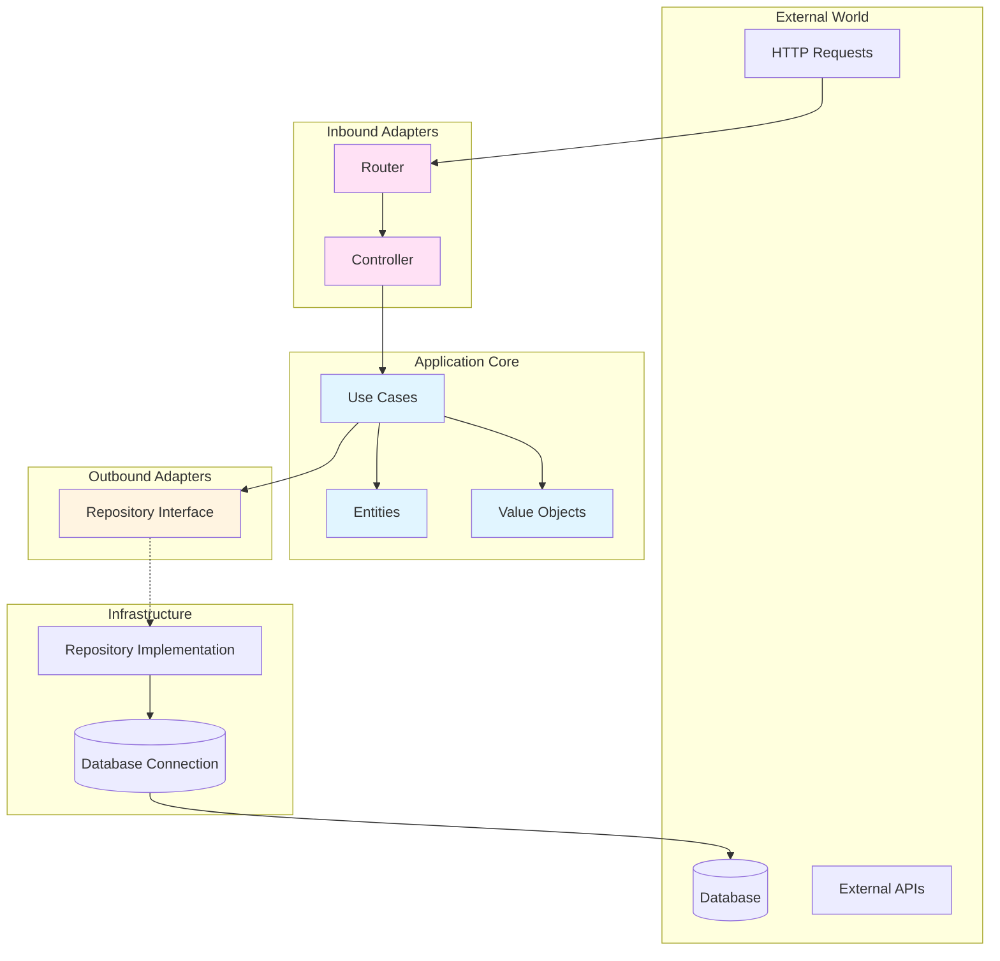
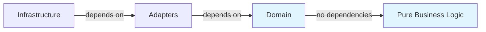

# 🏗️ Hexagonal Architecture

[← Back to Main README](../README.md)

## Table of Contents

- [Overview](#overview)
- [Core Principles](#core-principles)
- [Architecture Layers](#architecture-layers)
- [Ports and Adapters](#ports-and-adapters)
- [Dependency Flow](#dependency-flow)
- [Implementation Details](#implementation-details)
- [Benefits](#benefits)

## Overview

**Hexagonal Architecture** (also known as **Ports and Adapters**) is an architectural pattern that isolates the core business logic from external concerns. The application is designed as a hexagon, with the domain at the center and adapters on the edges.

### Key Concept

> The core idea is to **isolate the application's core logic** from external frameworks, databases, and user interfaces, making the system independent and easily testable.

## Core Principles

### 1. **Dependency Inversion**

Dependencies point **inward** toward the domain:
- Domain has **no dependencies** on external frameworks
- Infrastructure depends on domain interfaces
- Business logic is **framework-agnostic**

### 2. **Ports and Adapters**

- **Ports** - Interfaces that define how the application communicates
  - **Inbound Ports** - Define how external systems can use the application
  - **Outbound Ports** - Define how the application uses external systems

- **Adapters** - Concrete implementations of ports
  - **Inbound Adapters** - Controllers, routers, CLI handlers
  - **Outbound Adapters** - Database repositories, external API clients

### 3. **Isolation**

The domain layer is **completely isolated** from:
- Web frameworks (Fastify, Express, etc.)
- Databases (PostgreSQL, MongoDB, etc.)
- External services (APIs, message queues, etc.)

## Architecture Layers



## Ports and Adapters

### Inbound Ports (Driving Ports)

**Purpose**: Define how external actors can interact with the application.

**Examples in our codebase:**

#### 1. HTTP Server Interface

```typescript
// shared/HttpServer.ts
export interface HTTPServer {
  get(path: string, handler: RouteHandler): void;
  post(path: string, handler: RouteHandler): void;
  put(path: string, handler: RouteHandler): void;
  delete(path: string, handler: RouteHandler): void;
  start: () => void;
  stop: () => Promise<void>;
}
```

This interface defines **how** the application accepts HTTP requests, but **not which framework** is used.

#### 2. Controller Base Class

```19:160:packages/backend/src/shared/Controller.ts
export default abstract class Controller {
  protected constructor() {}

  protected mapProjectErrorToResponse(error: Error): Response {
    const body: Response['body'] = { message: error.message };

    if (error instanceof ValidationError) {
      return {
        body,
        httpCode: 400,
      };
    }

    if (error instanceof NotFoundError) {
      return {
        body,
        httpCode: 404,
      };
    }

    if (error instanceof DuplicateError) {
      return {
        body,
        httpCode: 409,
      };
    }

    if (error instanceof ForbiddenError) {
      return {
        body,
        httpCode: 403,
      };
    }

    return {
      body: { message: 'Internal Server Error' },
      httpCode: 500,
    };
  }

  protected runEffect =
    () =>
    async (effect: Effect.Effect<Response, Error>): Promise<Response> => {
      const exit = await Effect.runPromiseExit(effect);

      return Exit.match(exit, {
        onSuccess: (response) => {
          return {
            body: response.body,
            httpCode: response.httpCode,
          };
        },
        onFailure: (cause) => {
          // TODO: Use pino
          console.log('Internal Server Error', cause);
          const error = Cause.failureOption(cause);
          if (Option.isSome(error)) {
            return this.mapProjectErrorToResponse(error.value);
          }

          return {
            body: { message: 'Internal Server Error' },
            httpCode: 500,
          };
        },
      });
    };

  protected runEffectToJson =
    (context: Context) =>
    async (effect: Effect.Effect<Response, Error>): Promise<void> => {
      const runnable = this.jsonBaseMapper(effect);
      const response = await this.runEffect()(runnable);
      await context.reply.status(response.httpCode).type('application/json').send(response.body);
    };

  protected jsonBaseMapper<E extends Error>(
    result: Effect.Effect<Response, E>
  ): Effect.Effect<Response, Error> {
    return Effect.flatMap(Effect.either(result), (either): Effect.Effect<Response> => {
      if (Either.isRight(either)) {
        const result = either.right;
        return Effect.succeed({
          body: result.body,
          httpCode: result.httpCode,
        });
      }

      const error = either.left;
      const body = { message: error.message };

      if (error instanceof ValidationError) {
        return Effect.succeed({
          body: {
            issues: error.issues,
            message: error.message,
          },
          httpCode: 400,
        });
      }

      if (error instanceof NotFoundError) {
        return Effect.succeed({
          body,
          httpCode: 404,
        });
      }

      if (error instanceof DuplicateError) {
        return Effect.succeed({
          body,
          httpCode: 409,
        });
      }

      if (error instanceof ForbiddenError) {
        return Effect.succeed({
          body,
          httpCode: 403,
        });
      }

      return Effect.die(error);
    });
  }

  protected validateSchema<T extends ZodSchema>(
    params: ValidatePayloadParams<T>
  ): Effect.Effect<z.infer<T>, ValidationError> {
    const { payload, schema } = params;

    const parseResult = schema.safeParse(payload);
    if (parseResult.success) {
      return Effect.succeed<z.infer<T>>(parseResult.data);
    }

    return Effect.fail(
      new ValidationError({ message: 'Invalid payload', issues: parseResult.error.issues })
    );
  }
}
```

### Outbound Ports (Driven Ports)

**Purpose**: Define how the application interacts with external systems.

**Example: Repository Interface**

```6:10:packages/backend/src/domains/notes-management/adapters/outbound/NotesRepository.ts
export interface NotesRepository {
  findAll(): Effect.Effect<Note[]>;
  findOneByIdOrFail(id: NoteId): Effect.Effect<Note, NoteNotFoundError>;
  saveOne(note: Note): Effect.Effect<void>;
}
```

This interface defines **what** the application needs from persistence, but **not how** it's implemented.

### Inbound Adapters

**Purpose**: Implement inbound ports, handle incoming requests.

**Example: Fastify HTTP Server**

```10:117:packages/backend/src/config/http/fastify.ts
export class FastifyHTTPServer implements HTTPServer {
  private readonly fastify: FastifyInstance;

  constructor(private readonly params: FastifyHTTPServerParams) {
    this.fastify = Fastify({
      disableRequestLogging: true,
      logger: this.params.isProduction
        ? true
        : {
            transport: {
              target: 'pino-pretty',
              options: {
                colorize: true,
                ignore: 'pid,hostname',
                translateTime: 'HH:MM:ss Z',
              },
            },
          },
    });
  }

  start(): void {
    this.fastify.listen({ host: this.params.host, port: this.params.port }, (err, address) => {
      if (err) {
        this.fastify.log.error(err);
        throw err;
      }
      this.fastify.log.info(`Server is running on ${address}`);
    });

    this.setupHealthCheckRoutes();
    this.setupRequestLogging();
  }

  async stop(): Promise<void> {
    await this.fastify.close();
  }

  setupHealthCheckRoutes(): void {
    this.fastify.get('/ping', (_, reply) => {
      return reply.status(200).send({ message: 'pong' });
    });

    this.fastify.get('/health-check', (_, reply) => {
      return reply.status(200).send({ status: 'healthy', uptime: process.uptime() });
    });
  }

  private setupRequestLogging(): void {
    this.fastify.addHook('preHandler', async (request) => {
      this.fastify.log.info(
        {
          method: request.method,
          url: request.url,
          body: request.body,
        },
        `${request.id} - Incoming request`
      );

      return Promise.resolve();
    });

    this.fastify.addHook('onSend', async (request, reply, payload) => {
      let parsedPayload = payload;
      if (typeof payload === 'string') {
        try {
          parsedPayload = JSON.parse(payload);
        } catch {
          parsedPayload = payload;
        }
      }

      this.fastify.log.info(
        {
          statusCode: reply.statusCode,
          method: request.method,
          url: request.url,
          body: parsedPayload,
        },
        `${request.id} - Request completed`
      );
    });
  }

  delete(path: string, handler: RouteHandler): void {
    this.fastify.delete(path, async (request, reply) => {
      await handler({ request, reply });
    });
  }

  get(path: string, handler: RouteHandler): void {
    this.fastify.get(path, async (request, reply) => {
      await handler({ request, reply });
    });
  }

  post(path: string, handler: RouteHandler): void {
    this.fastify.post(path, async (request, reply) => {
      await handler({ request, reply });
    });
  }

  put(path: string, handler: RouteHandler): void {
    this.fastify.put(path, async (request, reply) => {
      await handler({ request, reply });
    });
  }
}
```

**Key Point**: The domain doesn't know about Fastify. If we wanted to switch to Express, we'd only change this adapter.

### Outbound Adapters

**Purpose**: Implement outbound ports, interact with external systems.

**Example: In-Memory Repository**

```7:33:packages/backend/src/infrastructure/in-memory/InMemoryNotesRepository.ts
export class InMemoryNotesRepository implements NotesRepository {
  private readonly notes: Map<NoteId, NoteState> = new Map();

  findAll(): Effect.Effect<Note[]> {
    return Effect.succeed(
      Array.from(this.notes.values())
        .filter((noteState) => noteState.deletedAt === null)
        .map((noteState) => Note.fromState(noteState))
    );
  }

  findOneByIdOrFail(id: NoteId): Effect.Effect<Note, NoteNotFoundError> {
    const noteState = this.notes.get(id);
    if (!noteState) {
      return Effect.fail(new NoteNotFoundError(id));
    }

    return Effect.succeed(Note.fromState(noteState));
  }

  saveOne(note: Note): Effect.Effect<void> {
    const state = note.toState();

    this.notes.set(state.id, state);
    return Effect.succeed(undefined);
  }
}
```

**Key Point**: To switch to PostgreSQL, we'd create a `PostgresNotesRepository` implementing the same interface.

## Dependency Flow

The dependency rule is **critical** in hexagonal architecture:

```
Infrastructure → Adapters → Domain
```

**Dependencies flow inward**, never outward:



### Example: Dependency Chain

```typescript
// ✅ CORRECT: Infrastructure depends on Domain
class PostgresNotesRepository implements NotesRepository {
  // Uses Note (domain entity)
  // Implements NotesRepository (outbound port)
}

// ❌ WRONG: Domain depends on Infrastructure
class Note {
  // Should NOT import PostgresNotesRepository
  // Should NOT know about database
}
```

## Implementation Details

### Layer Responsibilities

| Layer | Responsibility | Dependencies |
|-------|---------------|--------------|
| **Domain** | Business logic, entities, value objects | None (pure TypeScript) |
| **Adapters Inbound** | Handle incoming requests | Domain interfaces |
| **Adapters Outbound** | Define external interfaces | Domain entities |
| **Infrastructure** | Concrete implementations | Adapter interfaces |

### Dependency Injection

Dependencies are injected at the **configuration layer**:

```10:35:packages/backend/src/config/dependency-injections/container.ts
export const container = (): DIContainer => {
  const {
    env,
    httpServer: { host, port },
  } = config;

  const httpServer = new FastifyHTTPServer({ isProduction: env === 'production', host, port });

  const notesManagement = notesManagementContainer({ httpServer });

  const publicRouters = [notesManagement.publicRouter];

  const start = (): void => {
    httpServer.start();
    publicRouters.forEach((router) => router.registerRoutes());
  };

  const stop = async (): Promise<void> => {
    await httpServer.stop();
  };

  return {
    start,
    stop,
  };
};
```

The container:
1. Creates infrastructure implementations
2. Injects them into adapters
3. Wires everything together
4. Domain remains **unaware** of these dependencies

## Benefits

### ✅ Testability

The domain can be tested **without** external dependencies:

```typescript
// Easy to test use cases with in-memory repositories
const repository = new InMemoryNotesRepository();
const useCase = new CreateNote({ notesRepository: repository });
// No database, no HTTP server needed
```

### ✅ Flexibility

Easy to swap implementations:

- Switch from Fastify to Express → Change one adapter
- Switch from PostgreSQL to MongoDB → Change repository implementation
- Add new transport (gRPC, WebSocket) → Add new inbound adapter

### ✅ Maintainability

Clear boundaries make the codebase:
- **Easier to understand** - Each layer has a clear purpose
- **Easier to modify** - Changes are isolated to specific layers
- **Easier to extend** - Add new features without affecting existing code

### ✅ Independence

The domain is **independent** of:
- Web frameworks
- Databases
- External services
- Infrastructure concerns

---

> 💡 **Next Steps**: Learn how this architecture is combined with [Domain-Driven Design](./domain-driven-design.md) principles, or see a [complete example](./domain-example.md) of how these layers work together.


