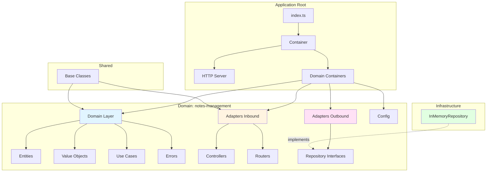

# 📁 Project Structure

[← Back to Main README](../README.md)

## Table of Contents

- [Overview](#overview)
- [Root Structure](#root-structure)
- [Source Directory](#source-directory)
- [Domain Organization](#domain-organization)
- [Layer Breakdown](#layer-breakdown)
- [File Naming Conventions](#file-naming-conventions)

## Overview

The backend project follows a **domain-driven** and **layered architecture** approach. The codebase is organized to promote:

- ✅ Clear separation of concerns
- ✅ Domain isolation (bounded contexts)
- ✅ Easy navigation and understanding
- ✅ Scalability and maintainability

## Root Structure

```
packages/backend/
├── src/                    # Source code
│   ├── config/            # Application configuration
│   ├── domains/          # Business domains (bounded contexts)
│   ├── infrastructure/    # Infrastructure implementations
│   ├── shared/            # Shared utilities and base classes
│   └── index.ts           # Application entry point
├── dist/                  # Compiled JavaScript (generated)
├── documentation/        # Documentation files
├── package.json           # Dependencies and scripts
└── tsconfig.json         # TypeScript configuration
```

## Source Directory

### `src/` - Main Source Code

The `src` directory contains all application source code organized by responsibility:

```
src/
├── config/                      # Configuration and setup
│   ├── dependency-injections/  # DI container setup
│   ├── env/                    # Environment configuration
│   └── http/                   # HTTP server configuration
│
├── domains/                    # Business domains
│   └── notes-management/       # Example domain
│
├── infrastructure/             # Infrastructure implementations
│   └── in-memory/              # In-memory implementations
│
├── shared/                     # Shared code
│   ├── Controller.ts           # Base controller class
│   ├── Entity.ts               # Base entity class
│   ├── HttpServer.ts           # HTTP server interface
│   ├── ProjectErrors.ts        # Error definitions
│   ├── UseCase.ts              # Base use case class
│   └── ValueObject.ts          # Base value object class
│
└── index.ts                    # Application entry point
```

## Domain Organization

Each domain (bounded context) is self-contained and follows a consistent structure:

```
domains/
└── notes-management/              # Domain name (kebab-case)
    ├── adapters/                 # Adapters layer
    │   ├── inbound/              # Incoming adapters
    │   │   ├── controllers/      # HTTP controllers
    │   │   └── routers/          # Route definitions
    │   └── outbound/             # Outgoing adapters
    │       └── NotesRepository.ts  # Repository interface
    │
    ├── config/                    # Domain configuration
    │   └── notes-management-container.ts  # DI container
    │
    ├── domain/                    # Core domain logic
    │   ├── entities/             # Domain entities
    │   ├── errors/                # Domain-specific errors
    │   ├── use-cases/            # Business use cases
    │   └── value-objects/        # Value objects
    │
    └── mappers/                   # DTO mappers
        └── NoteMapper.ts
```

### Domain Structure Breakdown

| Directory               | Purpose                  | Example                          |
| ----------------------- | ------------------------ | -------------------------------- |
| `adapters/inbound/`     | Entry points (HTTP)      | Controllers, Routers             |
| `adapters/outbound/`    | Exit points (interfaces) | Repository interfaces            |
| `config/`               | Domain DI configuration  | Container setup                  |
| `domain/entities/`      | Business entities        | `Note.ts`                        |
| `domain/errors/`        | Domain errors            | `NoteNotFoundError.ts`           |
| `domain/use-cases/`     | Business operations      | `CreateNote.ts`, `UpdateNote.ts` |
| `domain/value-objects/` | Immutable values         | `NoteTitle.ts`, `NoteContent.ts` |
| `mappers/`              | DTO transformations      | `NoteMapper.ts`                  |

## Layer Breakdown

### 🎯 Domain Layer (`domain/`)

The **core** of the application - contains pure business logic with no external dependencies.

**Contains:**

- **Entities** - Objects with identity and lifecycle
- **Value Objects** - Immutable objects without identity
- **Use Cases** - Business operations and workflows
- **Domain Errors** - Business-specific error types

**Example:**

```typescript
// domain/entities/Note.ts
export class Note extends BaseEntity<NoteState> {
  static create(params: NoteCreateParams): Note { ... }
  delete(): this { ... }
  setContent(content: NoteContent): this { ... }
}
```

### 🔌 Adapters Layer (`adapters/`)

**Inbound Adapters** - Handle incoming requests:

- **Controllers** - Process HTTP requests, validate input, call use cases
- **Routers** - Define HTTP routes and map them to controllers

**Outbound Adapters** - Define interfaces for external systems:

- **Repository Interfaces** - Define persistence contracts

**Example:**

```typescript
// adapters/inbound/controllers/NotesController.ts
export class NotesController extends Controller {
  async createOne(context: Context): Promise<void> { ... }
}
```

### 🏗️ Infrastructure Layer (`infrastructure/`)

Concrete implementations of outbound adapters:

- Database implementations
- External service clients
- In-memory implementations (for testing/development)

**Example:**

```typescript
// infrastructure/in-memory/InMemoryNotesRepository.ts
export class InMemoryNotesRepository implements NotesRepository {
  findAll(): Effect.Effect<Note[]> { ... }
}
```

### 🔧 Configuration Layer (`config/`)

Application and domain configuration:

- Dependency injection setup
- Environment configuration
- HTTP server setup

**Example:**

```typescript
// config/dependency-injections/container.ts
export const container = (): DIContainer => {
  const httpServer = new FastifyHTTPServer({ ... });
  const notesManagement = notesManagementContainer({ httpServer });
  return { start, stop };
};
```

### 🔗 Shared Layer (`shared/`)

Common base classes and utilities used across domains:

- `BaseEntity` - Base class for entities
- `ValueObject` - Base class for value objects
- `Controller` - Base class for controllers
- `UseCase` - Base class for use cases
- `HttpServer` - HTTP server interface
- `ProjectErrors` - Common error types

## File Naming Conventions

### Files

| Type           | Convention       | Example                               |
| -------------- | ---------------- | ------------------------------------- |
| **Classes**    | PascalCase       | `Note.ts`, `NotesController.ts`       |
| **Interfaces** | PascalCase       | `NotesRepository.ts`, `HttpServer.ts` |
| **Types**      | PascalCase       | `NoteState.ts`, `CreateNoteParams.ts` |
| **Utilities**  | camelCase        | `noteMapper.ts` (if needed)           |
| **Constants**  | UPPER_SNAKE_CASE | `MAX_NOTE_LENGTH.ts` (if needed)      |

### Directories

| Type        | Convention | Example                        |
| ----------- | ---------- | ------------------------------ |
| **Domains** | kebab-case | `notes-management/`            |
| **Layers**  | kebab-case | `use-cases/`, `value-objects/` |
| **General** | kebab-case | `dependency-injections/`       |

## Key Principles

### 1. Domain Isolation

Each domain is **self-contained** and should not directly depend on other domains. Communication between domains should go through well-defined interfaces.

### 2. Dependency Direction

Dependencies flow **inward**:

- Infrastructure → Adapters → Domain
- Domain has **no dependencies** on infrastructure

### 3. Single Responsibility

Each file and directory has a **single, clear responsibility**:

- One entity per file
- One use case per file
- One controller per domain

### 4. Consistency

The structure is **consistent** across all domains, making it easy to:

- Navigate the codebase
- Understand new domains
- Onboard new developers

## Visual Structure



---

> 💡 **Next Steps**: Learn about the [Hexagonal Architecture](./hexagonal-architecture.md) to understand how these layers interact, or explore the [Domain-Driven Design](./domain-driven-design.md) concepts used in this structure.
